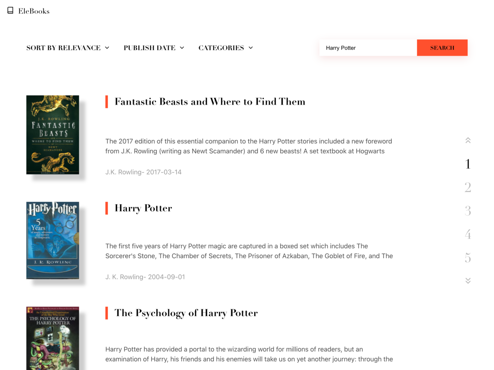

[Try App](https://finding-books.vercel.app/)

I have built a series of mini apps to combine art with engineering. 
These are my original creations that does not rely UI libraries. 

This is a app wraps the GOOGLE books api with my own UI solution. Since this app
focus on exploring visual elements and typography. It is not fully functional with some 
of the component such as filtering and pagination. 

### Technologies 
React | Sass | Google Books API | React-Spring

