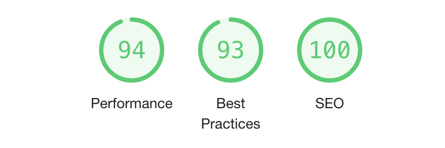

## Introduction

Gatsby and Netlify CMS work perfectly together to create high performance and fast speed static websites. This article is a tutorial on how to build a blog with these technologies from scratch.

## Switching from templates platforms to Gatsby

In the past I have used platforms such as Wordpress and SquareSpace to host my portfolio website. Both are very handy tools when I was looking for something visual and easy to use. However, as I am seeking more and more flexibility and creativity, I kept injecting Javascript code to the site, thus making it very slow. Beside, all these platforms wraps my website with tons of layers, therefore the performance was diminished. It was acceptable to access the site from US, where I host it. However, it could even a minute to just get the first print, if I try to open it from another country. Therefore, I decided to build a **high performance** using the trending Gatsby framework and used Netlify CMS as the backend content management system. The result is astonishing. With the new site, I successfully boosted my performance from 20 with my old Wordpress site to an incredible 93. 



## Step 1 - Initiate your Gatsby project 
<em>Before you read through the article, I assume that you have basic knowledge of React. Because the Gatsby framework is based on React. </em>

In order to start the a Gatsby project, I had to install it globally. The official website has a very straight forward [tutorial](https://www.gatsbyjs.org/docs/quick-start), so it would be redundant for me to repeat that process. In this article, I will skip the straight forward pieces and provide a link to the official guidance, and explain the areas that was more confusing. 

## Step 2 - Create a basic layout for your website
Once I have the basic project set up, I created the static pages under the 
``` src/pages ``` directory once you initiated your project with Gatsby. You can write anything like in any other React app. 

Then I added ``` blogTemplate.js ``` to the  ``` src/templates ``` directory for  dynamically generated pages. Gatsby is capable of generating static pages by sourcing data from other APIs. Gatsby websites are super fast because it already requested data from the server and build the site before the user visit it. 