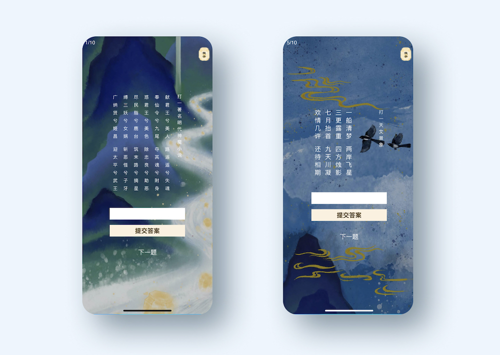

<iframe src="https://player.vimeo.com/video/459808069" width="640" height="480" frameborder="0" allow="autoplay; fullscreen" allowfullscreen></iframe>

[Try App](https://chinese-valentine-qixi.vercel.app/)

### Description
This is a mini mobile web riddle game, that I created for Chinese Valentine's day - QIXI. 
I get inspired by the Chinese fairytale of NiuLang who traveled to the celestial palace to meet his lover Zhinv. 
This is a 100% original piece by me and other 3 team members. We did not copy or use any other code, riddle or illustration. 

### Technologies 
React | Photoshop | Airtable | Google Analytics 

### My Role 
Product Owner; UI/UX Design; Development

### Highlights

- Attracted 5000 users on the Chinese valentine's day without any paid advertising 
- Attracted 1 commercial sponsor 
- Had average user session of more than 5 minutes

### Concepting
Surrounded by social media, now a days young people tend to read much less classics and forget how to correctly write Chinese characters.
In order to help people recall the traditions and spread the knowledge of classic literature. I decided to develop a mini web app for the
QIXI- the traditional Chinese valentine's day. 

I initialized this idea of helping the couple Niulang and Zhinv to meet and travel with Niulang from the ground up to the sky while
answering ancient poetry style chinese riddles and enjoy the beautiful view. Then, I invited 2 writers and 1 artist to the 
project.

